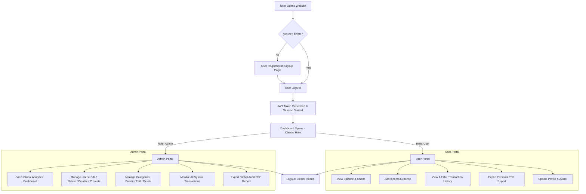

# Expense Tracker System - Viva & Setup Guide

This document is a comprehensive guide to the **Personal Expense Tracker System**, prepared for your project presentation, demonstration, and viva. It is written in simple, clear, and professional English to help you explain the project structure, features, logic, and architecture to your instructor.

---

## 1. Project Introduction

### What is the Expense Tracker System?
The **Personal Expense Tracker System** is an enterprise-grade, premium web application designed to track, categorize, and manage personal finances. It allows users to log their incomes and expenses, organize transactions into custom categories, view visual charts of their financial habits, and export detailed PDF statements. It also includes a secure, separate **Administrator Portal** to monitor all system activity, manage users, modify transaction categories, view global metrics, and export overall system audit reports.

### Why was this project developed?
In today's fast-paced world, managing personal finances is critical. Traditional methods like recording expenses in physical diaries or Excel sheets have several limitations:
1. **Time-consuming**: Entering transactions manually on a spreadsheet is slow and repetitive.
2. **Error-prone**: Calculating balances manually often leads to errors.
3. **No visual insights**: Flat logs do not help users quickly see where they are spending the most money.
4. **Lack of security**: Local sheets can easily be lost or accessed by unauthorized people.

This project was developed to automate the process of recording, calculation, and visual analysis. It provides an all-in-one digital solution that is accessible from anywhere.

### What problem does it solve?
* **Lack of Budgeting Control**: Users often do not know where their salary is spent. By logging transactions, they can see exact spending categories.
* **Manual Mathematics**: It automatically calculates total incomes, total expenses, and the net balance in real-time, removing manual errors.
* **Data Organization**: Rather than scanning mixed receipts, users can search, sort, and filter transactions by date, type (Income/Expense), or category.
* **Administrative Moderation**: Provides administrators a way to monitor malicious users, disable abusive accounts, and standardise expense categories.

### Who can use this system?
* **Students**: To manage their monthly pocket money and study expenses.
* **Salaried Professionals**: To track their primary income, manage home budgets, bills, and monthly savings.
* **Freelancers / Self-employed**: To monitor business incoming revenue against operational expenses.
* **System Administrators**: High-level managers who monitor system health, check active user metrics, and control system configuration parameters.

### Main Objectives
1. Provide a clean, premium, and fully responsive user interface (UI) with Light and Dark mode options.
2. Enable quick entry of transactions with server-validated amounts, dates, and descriptions.
3. Generate automated, clean financial reports in PDF format for archiving or accounting.
4. Keep user data completely isolated and secure using modern encryption (hashing) and session management.
5. Create a unified administrator portal for overall platform control and audit logging.

### Real-World Applications
* **Monthly Budgeting**: Budgeting for food, transport, bills, and shopping.
* **Tax Preparation**: Using the exported PDF report to calculate yearly tax write-offs.
* **Financial Habits Reform**: Helping users identify unnecessary expenditures (e.g., high entertainment costs) to save more money.

### Overall Workflow of the System
The following diagram illustrates the workflow:



---

## 2. Project Features

### User Registration
New users can register by entering their full name, email, password, gender, date of birth, and country on the registration page. Passwords are encrypted on the backend, and registration automatically logs the user in.

### User Login
Users log in using their registered email and password. The system checks their credentials, verifies if the account is active (not disabled by an admin), and generates a secure JSON Web Token (JWT) for authentication.

### Admin Login
The system does not have a separate admin login page. Instead, a single unified login portal handles all logins. The server detects the user's role (`admin` or `user`) from the database and automatically redirects administrators to the Admin Portal (`/frontend/admin/index.html`) and regular users to the User Dashboard (`/frontend/user/dashboard.html`).

### User Dashboard
An overview page for regular users showing:
* **Key Statistics**: Total Income, Total Expenses, and Net Balance (calculated dynamically).
* **Interactive Charts**: A doughnut chart representing expenses by category, and a bar chart showing income versus expense comparisons.
* **Recent Transactions**: A quick list of the last 5 transactions entered.

### Add Income & Expense
Users can add transactions by specifying:
* **Type**: Income (positive flow) or Expense (negative flow).
* **Amount**: Value greater than 0 (validated by the server).
* **Category**: Selected from a dropdown populated by active categories.
* **Date**: The date the transaction occurred.
* **Description**: A short note describing the transaction.

### Transaction History (Ledger)
A detailed history page where users can view all their transactions. It includes:
* **Text Search**: Search by category or description.
* **Filtering**: Filter by type (Income vs Expense) or Category.
* **Sorting**: Sort by date (newest/oldest) or transaction amount (highest/lowest).
* **Actions**: Edit or delete buttons for each transaction.

### Reports & PDF Export
* **Personal Reports**: Users can view summaries of income vs expense and download their entire ledger as a formatted PDF.
* **Global Admin Reports**: Administrators can download system-wide transaction reports in PDF format.
* **PDF Kit Generation**: PDF files are generated directly on the backend server using the `pdfkit` library, ensuring they are official and un-tampered.

### Charts & Spending Breakdown
Both user dashboards and reports contain interactive canvas graphics generated using **Chart.js**. The application automatically detects theme changes (Light/Dark mode) and updates chart colors, labels, and grids dynamically to match the active theme.

### Category Management (Admin-Only)
Administrators have a dedicated category page to control spending classifications.
* **Create Category**: Add new categories (e.g., "Health", "Investments").
* **Edit Category**: Rename existing categories. (Renaming automatically updates the category name on all existing transactions in the database).
* **Delete Category**: Delete a category. (Prevented if the category is currently used by any transaction to maintain database integrity).
* **Status Toggle**: Set categories to `active` or `disabled`. Disabled categories will not appear in the user's dropdown lists.

### User Management (Admin-Only)
Administrators have access to a user directory showing registration details, status, and system roles.
* **View Users**: Search users by name or email, or filter by role and status.
* **Edit User**: Update a user's name, email, password, role (`user` / `admin`), and status (`active` / `disabled`).
* **Delete User**: Permanently delete a user account. This triggers a **cascade delete** that automatically removes all transaction documents belonging to this user from the database.
* **System Lockout Protection**: The system prevents admins from deleting or demoting their own accounts, or deleting other administrators.

### Profile Management
Both users and admins can manage their profiles:
* Edit user profile details (Name, Email, Gender, Country, Date of Birth).
* Update Password (requires entering the correct current password first).
* **Avatar Upload**: Upload profile pictures. Pictures are sent as base64 data to the backend, converted to file buffers, and saved directly to the backend disk under `/uploads/profiles/`. The user document stores the local relative path to reference the file.

### Role-Based Access Control (RBAC)
Implemented on both the frontend and backend.
* **Backend Security**: Routes starting with `/api/admin` or administrative functions on `/api/categories` run through an authorization middleware (`authorizeRoles('admin')`). If a regular user sends an HTTP request to these endpoints, the server returns a `403 Forbidden` response.
* **Frontend Routing Protection**: Script guards check the active user's role from local storage and cookies on page load, redirecting unauthorized users.

---

## 3. Complete Technology Stack

The project uses a standard, high-performance **MERN-like stack** (replacing React with Vanilla HTML5, CSS3, and JavaScript modules for speed, compatibility, and simplicity).

```
   ┌────────────────────────────────────────────────────────┐
   │                       FRONTEND                         │
   │           HTML5  •  CSS3  •  Vanilla JS                │
   └───────────────────────────┬────────────────────────────┘
                               │ HTTP Request (Fetch API)
                               ▼
   ┌────────────────────────────────────────────────────────┐
   │                       BACKEND                          │
   │               Node.js  •  Express.js                   │
   └───────────────────────────┬────────────────────────────┘
                               │ Mongoose ODM
                               ▼
   ┌────────────────────────────────────────────────────────┐
   │                      DATABASE                          │
   │                      MongoDB                           │
   └────────────────────────────────────────────────────────┘
```

### Frontend Technologies
* **HTML5**: Defines the structural layout of the web pages, forms, tables, and sidebars.
* **CSS3**: Styles the user interface. Uses modern features like CSS Variables, HSL color palettes, custom scrollbars, transitions, keyframe animations, and flexbox/grid layouts.
* **Vanilla JavaScript (ES6+)**: Handles user interaction, form validation, dynamic list rendering, theme toggling, and asynchronous communications (using the native `fetch` API and `async/await`) with the backend API.
* **Chart.js**: Client-side library used to draw financial statistics in canvas elements.

### Backend Technologies
* **Node.js**: Asynchronous, event-driven JavaScript runtime environment used to run the server.
* **Express.js**: Minimalist and flexible web framework for Node.js used to define API routes, handle requests, and run middleware.

### Database Technologies
* **MongoDB**: A document-oriented, NoSQL database that stores data in JSON-like BSON documents. It was chosen for its flexibility, ease of scaling, and fast query execution.
* **Mongoose**: An Object Data Modeling (ODM) library for MongoDB and Node.js. It manages database connections, validates schemas, and handles model relationships.

### Authentication & Security
* **JWT (JSON Web Token)**: An open standard used to securely transmit information between the client and server as a JSON object. Used to maintain user login sessions.
* **BcryptJS**: A password-hashing library used to hash passwords with a secure salt factor (10 rounds) before saving them to the database.

### Library Dependencies (Explained from `package.json`)

Here is the explanation of every dependency installed in the backend [package.json](file:///C:/Users/sanam/Pictures/expence_tracker/backend/package.json):

| Library | Purpose | Where Used in Project |
| :--- | :--- | :--- |
| **express** | Core backend web framework. Handles HTTP routing, middleware, and request/response mappings. | Mounts in [backend/server.js](file:///C:/Users/sanam/Pictures/expence_tracker/backend/server.js) to start the API server. |
| **mongoose** | MongoDB Object Data Modeling (ODM) framework. Maps JS objects to MongoDB documents. | Used in all models: [User.js](file:///C:/Users/sanam/Pictures/expence_tracker/backend/models/User.js), [Category.js](file:///C:/Users/sanam/Pictures/expence_tracker/backend/models/Category.js), and [Transaction.js](file:///C:/Users/sanam/Pictures/expence_tracker/backend/models/Transaction.js). |
| **bcryptjs** | Hashes passwords during signup and compares them during login using secure hashing algorithms. | Used in [authController.js](file:///C:/Users/sanam/Pictures/expence_tracker/backend/controllers/authController.js) and [adminController.js](file:///C:/Users/sanam/Pictures/expence_tracker/backend/controllers/adminController.js) for passwords. |
| **jsonwebtoken** | Generates (signs) session tokens on login/signup and validates them on protected routes. | Signed in [authController.js](file:///C:/Users/sanam/Pictures/expence_tracker/backend/controllers/authController.js) and verified in [auth.js](file:///C:/Users/sanam/Pictures/expence_tracker/backend/middleware/auth.js). |
| **cors** | Enables Cross-Origin Resource Sharing, allowing frontend requests from port 5500 to backend port 5000. | Registered as global middleware in [backend/server.js](file:///C:/Users/sanam/Pictures/expence_tracker/backend/server.js). |
| **cookie-parser** | Parses Cookie headers and populates `req.cookies` with the JWT token. | Configured in [backend/server.js](file:///C:/Users/sanam/Pictures/expence_tracker/backend/server.js) to retrieve HttpOnly credentials. |
| **dotenv** | Loads environment configurations (port, DB URI, defaults) from a `.env` file into `process.env`. | Loaded on first line of [backend/server.js](file:///C:/Users/sanam/Pictures/expence_tracker/backend/server.js). |
| **express-rate-limit** | Protects endpoints from brute-force login attacks by limiting IPs to a maximum number of requests. | Configured in [authRoutes.js](file:///C:/Users/sanam/Pictures/expence_tracker/backend/routes/authRoutes.js) (limits IPs to 15 requests per 15 minutes). |
| **nodemailer** | Connects to SMTP email servers to send automated recovery links to users. | Implemented inside [emailService.js](file:///C:/Users/sanam/Pictures/expence_tracker/backend/services/emailService.js). |
| **pdfkit** | Backend library that creates custom, multi-page vector PDF documents on the fly. | Used in [transactionController.js](file:///C:/Users/sanam/Pictures/expence_tracker/backend/controllers/transactionController.js) and [adminController.js](file:///C:/Users/sanam/Pictures/expence_tracker/backend/controllers/adminController.js). |
| **body-parser** | Explicitly parses JSON payloads and URL-encoded structures in incoming request bodies. | Configured as middleware in [backend/server.js](file:///C:/Users/sanam/Pictures/expence_tracker/backend/server.js) with 10MB limits. |
| **nodemon** *(Dev)* | Developer tool that automatically restarts the Node server whenever a backend file is modified. | Used in the development startup script `npm run dev`. |

---

## 4. Project Architecture

The application is structured around a **Model-View-Controller (MVC) / REST API Architecture**.

* **Model (Database Layer)**: Managed by Mongoose. Defines user data structures, transaction variables, and categories in MongoDB.
* **View (User Interface)**: Managed by client-side browser files (HTML, CSS, JS modules). No template engine is used; DOM manipulation is handled dynamically in client scripts.
* **Controller (Logic Layer)**: Functions that receive API requests from routes, interact with the model to fetch or update records, and send back structured JSON responses.

### Data Flow Diagram (How data flows through the application)

The diagram below represents the exact step-by-step lifecycle of an API request:

```
[Browser Client] 
   │
   ├─► 1. Forms submission / Event Trigger (e.g., Click 'Add Transaction')
   ├─► 2. JS builds request payload & calls authFetch()
   │
   ▼
[HTTP Request Network Transport]
   │
   ├─► 3. CORS Check (Verifies if origin localhost:5500 is allowed)
   ├─► 4. Cookie-Parser / Header parsing (Extracts JWT token)
   ├─► 5. AuthenticateUser Middleware (Checks if JWT is valid & User status is Active)
   ├─► 6. AuthorizeRoles Middleware (For Admin endpoints, checks if role is admin)
   │
   ▼
[Express Router]
   │
   └─► 7. Maps URL (e.g., POST /api/transactions) to correct Controller Function
   │
   ▼
[Controller Layer]
   │
   ├─► 8. Extracts data from req.body (e.g., amount, type, category)
   ├─► 9. Validates inputs (e.g., amount is positive number)
   │
   ▼
[Model Database Layer (Mongoose)]
   │
   ├─► 10. Interacts with MongoDB using ODM methods (e.g., newTransaction.save())
   ├─► 11. Database executes query and returns data to model
   │
   ▼
[Controller Response]
   │
   ├─► 12. Formats database document (e.g., formats dates to YYYY-MM-DD)
   ├─► 13. Returns HTTP Status (e.g., 201 Created) and JSON payload
   │
   ▼
[Browser JS Parser]
   │
   └─► 14. UI parses response, displays a success Toast, updates charts, and renders lists
```

---

## 5. Folder Structure Explanation

The project is structured into clear frontend and backend folders. This maintains a clean separation of concerns:

```text
/Personal_Expense_Tracker
│
├── /docs
│   └── SetupGuide.md              ◄── This document (Presentation & Setup Guide)
│
├── /backend
│   ├── /config                    ◄── Configuration references (handled by .env variables)
│   ├── /controllers               ◄── Request managers (handles DB access and business logic)
│   ├── /middleware                ◄── Secure request interceptors (JWT checks, Role authorization)
│   ├── /models                    ◄── Database Schemas (User, Category, Transaction)
│   ├── /routes                    ◄── API endpoint URL mappings
│   ├── /scripts                   ◄── Database setup/cleanup tools (resetDb.js)
│   ├── /seed                      ◄── Startup data loading utilities (seeder.js)
│   ├── /services                  ◄── External integrations (emailService.js)
│   ├── /uploads                   ◄── Uploaded files (profile pictures stored locally)
│   │   └── /profiles
│   ├── /utils                     ◄── Helper utilities (formatters.js)
│   ├── .env                       ◄── Secret environment credentials
│   ├── .env.example               ◄── Reference environment configurations
│   ├── package.json               ◄── Backend scripts and library dependencies
│   └── server.js                  ◄── App startup entrypoint
│
└── /frontend
    ├── /admin                     ◄── Admin views (Overview, Users, Categories, Reports, Settings)
    ├── /user                      ◄── User views (Dashboard, Transactions, Reports, Profile, Add)
    ├── /public                    ◄── Public static pages (Landing index, about pages)
    ├── /css                       ◄── Global stylesheet styles (style.css)
    └── /js                        ◄── Client scripting (api.js, script.js, admin.js)
```

* **docs/**: Project guide and presentation documentation folder.
* **backend/**: Contains all server-side directories. No HTML/CSS files are here.
* **controllers/**: Houses functions like `login`, `addTransaction`, or `getUsers` which hold the main business logic.
* **middleware/**: Contains files like `auth.js` to protect routes from unauthorized access.
* **models/**: Houses Mongoose schema definitions which define how users, categories, and transactions look in MongoDB.
* **routes/**: Maps backend endpoints (such as `/api/auth/register`) to their controller handlers.
* **scripts/**: Contains maintenance utilities like `resetDb.js` to clear databases during development.
* **seed/**: Contains `seeder.js` to automatically create default categories and the first Admin account.
* **services/**: Holds integrations like Nodemailer to send emails.
* **uploads/profiles/**: Folder where user profile pictures are physically saved.
* **utils/**: Small helper scripts like `formatters.js` to clean database outputs.
* **frontend/**: Client-side files. Can be served by a web server (like VS Code Live Server).
* **frontend/admin/**: Holds HTML portals for system admins.
* **frontend/user/**: Holds HTML portals for users (dashboard, transactions, reports, settings).
* **frontend/public/**: Static public pages. Users see this landing page when opening the site for the first time.
* **frontend/css/**: Shared stylesheets handling Light/Dark themes and interactive animations.
* **frontend/js/**: Shared JS files. `api.js` runs on every page to process authorization status, alerts, and custom selectors.

---

## 6. Backend Explanation

### Why was Node.js selected?
* **Single Language Stack**: Allows using JavaScript on both the frontend and backend, reducing developer context switching.
* **Asynchronous & Non-blocking I/O**: Makes it fast at handling concurrent requests (e.g., many users loading dashboards at the same time).
* **Rich Ecosystem**: npm offers thousands of reusable packages (like `mongoose`, `pdfkit`, `bcryptjs`), reducing development time.

### Why was Express.js selected?
Node.js's built-in `http` module is complex for routing and parsing. Express.js sits on top of Node.js and provides:
* Simple route definitions (e.g., `app.get()`, `app.post()`).
* Easy integration of middleware (e.g., CORS, Rate Limiting, JSON parsers).
* Standardized request/response handling.

### How API Requests Work
1. The frontend browser runs a script making a network request: `fetch('http://localhost:5000/api/transactions')`.
2. The Node.js runtime receives the raw TCP socket data.
3. Express parses it into user-friendly JavaScript objects: `req` (Request details) and `res` (methods to send responses).
4. The request runs through middlewares (like authorization) to verify credentials.
5. The request hits the controller. The controller queries MongoDB through Mongoose.
6. The controller returns a JSON payload to the client.

### What is a REST API?
**REST (Representational State Transfer)** is an architectural style for network applications. It uses standard HTTP methods to perform CRUD operations on resources:
* **GET**: Retrieve resource details (e.g., fetch transactions).
* **POST**: Create a new resource (e.g., add an expense).
* **PUT**: Modify/replace a resource (e.g., update a user profile).
* **DELETE**: Remove a resource (e.g., delete a transaction).

### CRUD Operations & Code Examples

Here is how CRUD operations are mapped to Mongoose models in our controllers:

#### 1. CREATE (Adding an Expense / Income)
Taken from [transactionController.js](file:///C:/Users/sanam/Pictures/expence_tracker/backend/controllers/transactionController.js#L58-L86):
```javascript
const newTransaction = new Transaction({
  userId: req.user._id,
  type: normalizedType === 'income' ? 'Income' : 'Expense',
  amount: numAmount,
  category,
  date,
  description: description || ''
});
await newTransaction.save();
```
* **Explanation**: Instantiates a new transaction document matching the `Transaction` schema and calls `.save()` to insert it into MongoDB.

#### 2. READ (Retrieving user transactions)
Taken from [transactionController.js](file:///C:/Users/sanam/Pictures/expence_tracker/backend/controllers/transactionController.js#L9-L44):
```javascript
const transactions = await Transaction.find(query).sort(sortOrder);
res.json(transactions.map(formatTransaction));
```
* **Explanation**: Uses the `.find(query)` method with user filters (search terms, types, dates) and sorts them based on user selection before returning them.

#### 3. UPDATE (Modifying a transaction)
Taken from [transactionController.js](file:///C:/Users/sanam/Pictures/expence_tracker/backend/controllers/transactionController.js#L92-L126):
```javascript
const transaction = await Transaction.findOne({ _id: req.params.id, userId: req.user._id });
if (amount !== undefined) {
  transaction.amount = parseFloat(amount);
}
// Other updates here...
await transaction.save();
```
* **Explanation**: Finds the single transaction belonging to the logged-in user, modifies the fields passed in the request body, and calls `.save()` to update it in the database.

#### 4. DELETE (Removing an expense)
Taken from [transactionController.js](file:///C:/Users/sanam/Pictures/expence_tracker/backend/controllers/transactionController.js#L128-L138):
```javascript
const transaction = await Transaction.findOneAndDelete({ _id: req.params.id, userId: req.user._id });
```
* **Explanation**: Finds the document matching both the transaction ID and user ID and deletes it instantly, preventing unauthorized users from deleting other users' expenses.

---

## 7. Postman

### Was Postman used?
Yes! Postman was used extensively to test and debug the backend REST API before the frontend interface was completed.

### Why is Postman used?
* **Frontend Independence**: Allows verifying that the database, routes, and controllers work perfectly without having to write or load the frontend UI.
* **Testing HTTP Methods**: Browsers cannot easily send POST, PUT, or DELETE requests from the address bar. Postman can trigger any HTTP method.
* **Custom Headers & Payloads**: Used to attach JWT Bearer tokens to headers and send raw JSON request bodies.
* **Response Inspection**: Displays the JSON response payload, HTTP Status Codes (like 200 OK, 201 Created, 400 Bad Request, 401 Unauthorized), and response times.

### Which APIs were tested?
* **Auth Routes**: `/api/auth/register`, `/api/auth/login`, `/api/auth/profile`, `/api/auth/forgot-password`, `/api/auth/reset-password`
* **Transaction Routes**: `/api/transactions` (GET, POST, PUT, DELETE) and `/api/transactions/export-pdf`
* **Admin Routes**: `/api/admin/users`, `/api/admin/transactions`, `/api/admin/reports`
* **Category Routes**: `/api/categories` (GET, POST, PUT, DELETE)

### How to test Login API in Postman
1. Set HTTP method to **POST**.
2. Enter URL: `http://localhost:5000/api/auth/login`.
3. In the **Body** tab, select **raw** and set format to **JSON**.
4. Input credentials:
   ```json
   {
     "email": "user@example.com",
     "password": "Password123"
   }
   ```
5. Click **Send**.
6. Check if status code is `200 OK`. The response body will return a `token` (JWT string) and `user` object. Save this token for subsequent requests.

### How to test Protected Transaction APIs in Postman
1. To call `GET http://localhost:5000/api/transactions`, copy the JWT token returned during login.
2. In Postman, go to the **Authorization** tab.
3. Select Type: **Bearer Token**.
4. Paste the JWT token into the **Token** field.
5. Click **Send**. The response returns the list of transactions. (Under the hood, Postman attaches this token as the header `Authorization: Bearer <token>`).

---

## 8. Authentication

The system uses token-based authentication using **JSON Web Tokens (JWT)**. No session variables are saved in the server's memory, making the backend stateless and scalable.

### User Registration Process
1. The user fills out the signup form and submits it.
2. The browser makes a `POST /api/auth/register` request containing signup details.
3. The server validates that the email is not already in use.
4. The backend hashes the password using **BcryptJS** with a salt factor of 10.
5. A new `User` document is created and saved to MongoDB.
6. A JWT is generated, stored in an HttpOnly cookie, and sent back in the response.

### User Login Process
1. The user enters their email and password and clicks Login.
2. The browser makes a `POST /api/auth/login` request.
3. The controller searches for the user by email in the database.
4. If found, it compares the entered password with the hashed password stored in the database using `bcrypt.compare()`.
5. If the password matches and the account status is active, a JWT is signed with the user's ID and role.
6. The token is sent in the response and saved as an HttpOnly cookie.

### Password Hashing
Storing passwords in plaintext is a security risk. If the database is compromised, all user accounts are exposed.
* **How it works**: Hashing is a one-way mathematical function. We pass the plaintext password through `bcrypt.hash()` during signup.
* **Salting**: Generates a random string (salt) and mixes it with the password before hashing. This prevents rainbow table dictionary attacks.
* **Matching**: During login, `bcrypt.compare()` hashes the entered password using the same salt and checks if it matches the hash stored in the database.

### JWT Authentication Flow
A JWT consists of three parts separated by dots: **Header**, **Payload**, and **Signature**.
1. **Header**: Contains token type (JWT) and hashing algorithm (HS256).
2. **Payload**: Contains non-secret claims (user ID, role, token expiry date).
3. **Signature**: Verifies that the sender is who they claim to be and ensures the message hasn't been changed along the way. Generated by combining the header, payload, and a secret key stored on the server (`JWT_SECRET`).

On subsequent requests, the browser sends the token in the headers or cookies. The server validates it:
```javascript
decoded = jwt.verify(token, JWT_SECRET);
```
If the signature matches and the token has not expired, the user is authenticated.

### Protected Routes (Middleware)
Protected endpoints (like adding transactions) use the `authenticateUser` middleware in [auth.js](file:///C:/Users/sanam/Pictures/expence_tracker/backend/middleware/auth.js#L27-L55):
1. Retrieves the token from cookies or the `Authorization` header.
2. Verifies the signature using `jwt.verify()`.
3. Loads the user document from the database using the ID in the payload.
4. Confirms that the user still exists and their status is `active`. (If their status is `disabled`, it returns a `403 Forbidden` response).
5. Appends the user object to the request object (`req.user = user`) and calls `next()` to move to the controller.

---

## 9. Role-Based Access Control (RBAC)

RBAC controls what pages and resources a user can access based on their assigned role (`user` or `admin`).

### Comparison of User vs Admin Privileges

| Platform Operation | Regular User | System Administrator | Why does this difference exist? |
| :--- | :---: | :---: | :--- |
| **User Registration** | ✅ | ✅ | Everyone can register an account. |
| **Personal Dashboard** | ✅ | ❌ | Users analyze personal data; Admins view global metrics. |
| **Add / Edit / Delete own transactions** | ✅ | ❌ | Admins monitor system-wide logs, not add personal transactions. |
| **Export personal PDF statements** | ✅ | ❌ | Personal financial accounting. |
| **Update own Profile & Password** | ✅ | ✅ | Standard profile management features. |
| **View global system analytics** | ❌ | ✅ | Administrators need system metrics to monitor platform usage. |
| **View user accounts list** | ❌ | ✅ | Admins need directories to manage user access. |
| **Edit/Update any user account** | ❌ | ✅ | Admins modify user details and reset passwords for support. |
| **Deactivate/Disable user account** | ❌ | ✅ | Needed to block spam, malicious, or abusive accounts. |
| **Activate user account** | ❌ | ✅ | Needed to reinstate deactivated accounts. |
| **Assign or revoke Admin role** | ❌ | ✅ | Admin user settings management (role editing). |
| **Delete user account** | ❌ | ✅ | Cascade delete option to remove users and their data. |
| **View all system transactions** | ❌ | ✅ | Admin transaction ledger auditing. |
| **Delete any transaction** | ❌ | ✅ | Admins can moderate or remove inappropriate data. |
| **Export global PDF reports** | ❌ | ✅ | Generates a global audit report of all system transactions. |
| **Manage categories (Create/Edit/Delete)** | ❌ | ✅ | Admins standardise spend categories globally. |
| **Access static system settings** | ❌ | ✅ | Admin panel shows database status and server configurations. |

### Why Admin has more privileges
Administrators are responsible for system moderation and security. They do not log personal expenses. Instead, they require tools to audit transaction volumes, ensure that bad actors are deactivated, reset passwords for locked-out accounts, and standardize the categories available to users. Giving users access to these features would expose private financial data and compromise the application's integrity.

---

## 10. Admin Functions (Technical Breakdown)

Here is the exact controller, API endpoint, and database logic for each admin function:

### 1. View Users List
* **Endpoint**: `GET /api/admin/users`
* **HTTP Method**: `GET`
* **Controller Function**: `getUsers()` in [adminController.js](file:///C:/Users/sanam/Pictures/expence_tracker/backend/controllers/adminController.js#L14-L33)
* **Database Model Updated**: Read-only query from `User` collection. (Uses `.select('-password')` to hide hashed passwords).

### 2. Edit User Details
* **Endpoint**: `PUT /api/admin/users/:id`
* **HTTP Method**: `PUT`
* **Controller Function**: `updateUser()` in [adminController.js](file:///C:/Users/sanam/Pictures/expence_tracker/backend/controllers/adminController.js#L35-L82)
* **Database Model Updated**: Updates `User` schema fields (`name`, `email`, `role`, `status`, `password`).

### 3. Deactivate/Activate User
* **Endpoint**: `PUT /api/admin/users/:id`
* **HTTP Method**: `PUT`
* **Controller Function**: `updateUser()` in [adminController.js](file:///C:/Users/sanam/Pictures/expence_tracker/backend/controllers/adminController.js#L35-L82)
* **Database Model Updated**: Modifies `status` field to `'disabled'` or `'active'` in the `User` collection.

### 4. Assign/Remove Admin Role
* **Endpoint**: `PUT /api/admin/users/:id`
* **HTTP Method**: `PUT`
* **Controller Function**: `updateUser()` in [adminController.js](file:///C:/Users/sanam/Pictures/expence_tracker/backend/controllers/adminController.js#L35-L82)
* **Database Model Updated**: Modifies `role` field to `'admin'` or `'user'` in the `User` collection.

### 5. Delete User Account (Cascade Delete)
* **Endpoint**: `C:\Users\sanam\Pictures\expence_tracker\backend\routes\adminRoutes.js` ──► `DELETE /api/admin/users/:id`
* **HTTP Method**: `DELETE`
* **Controller Function**: `deleteUser()` in [adminController.js](file:///C:/Users/sanam/Pictures/expence_tracker/backend/controllers/adminController.js#L84-L109)
* **Database Model Updated**:
  1. Deletes all transaction records where `userId === req.params.id` in `Transaction` model.
  2. Deletes the user record from `User` model using `findByIdAndDelete()`.

### 6. Manage Categories (Create, Edit, Delete)
* **Endpoints**:
  * Create: `POST /api/categories`
  * Edit: `PUT /api/categories/:id`
  * Delete: `DELETE /api/categories/:id`
* **HTTP Methods**: `POST`, `PUT`, `DELETE`
* **Controller Functions**: `createCategory()`, `updateCategory()`, `deleteCategory()` in [categoryController.js](file:///C:/Users/sanam/Pictures/expence_tracker/backend/controllers/categoryController.js)
* **Database Model Updated**: Modifies the `Category` collection.
  * **Integrity Lock**: In `deleteCategory`, the system checks `Transaction.exists({ category: category.name })`. If true, deletion is blocked because deleting it would orphan existing transaction classifications.
  * **Integrity Sync**: In `updateCategory`, if a category name is updated, the controller runs `Transaction.updateMany({ category: oldName }, { category: trimmedName })` to keep transactions synchronized.

### 7. Monitor All Transactions
* **Endpoint**: `GET /api/admin/transactions`
* **HTTP Method**: `GET`
* **Controller Function**: `getAdminTransactions()` in [adminController.js](file:///C:/Users/sanam/Pictures/expence_tracker/backend/controllers/adminController.js#L113-L155)
* **Database Model Updated**: Read-only query. Fetches all transaction records, populating user IDs with user names and email details for display: `Transaction.find().populate('userId', 'name email')`.

### 8. Delete Transaction (Moderation)
* **Endpoint**: `DELETE /api/admin/transactions/:id`
* **HTTP Method**: `DELETE`
* **Controller Function**: `deleteAdminTransaction()` in [adminController.js](file:///C:/Users/sanam/Pictures/expence_tracker/backend/controllers/adminController.js#L157-L167)
* **Database Model Updated**: Deletes transaction from `Transaction` model.

### 9. View Reports & Analytics Metrics
* **Endpoint**: `GET /api/admin/reports`
* **HTTP Method**: `GET`
* **Controller Function**: `getAdminReports()` in [adminController.js](file:///C:/Users/sanam/Pictures/expence_tracker/backend/controllers/adminController.js#L171-L241)
* **Database Model Updated**: Read-only query. Runs aggregations across `User` and `Transaction` models using `Promise.all` to calculate system-wide metrics (total balance, users count, active count, category expenses, and recent activities).

### 10. System settings overview
* **Frontend Page**: [frontend/admin/settings.html](file:///C:/Users/sanam/Pictures/expence_tracker/frontend/admin/settings.html)
* **API Details**: (Read-only configurations visualised in UI).
* **Explanation**: The settings page displays status flags like runtime ports (5000), database types (MongoDB), and JWT validity parameters. Changing these settings is done securely by modifying the server's `.env` configuration file rather than exposing write controls on the UI.

---

## 11. Backend Functions

The following table summarizes all important backend controller functions:

| Function Name | Location File | HTTP Method | Route Endpoint | Purpose |
| :--- | :--- | :--- | :--- | :--- |
| **register** | [authController.js](file:///C:/Users/sanam/Pictures/expence_tracker/backend/controllers/authController.js) | `POST` | `/api/auth/register` | Registers a new user, hashes their password, and logs them in. |
| **login** | [authController.js](file:///C:/Users/sanam/Pictures/expence_tracker/backend/controllers/authController.js) | `POST` | `/api/auth/login` | Validates credentials, checks if the account is active, and returns a JWT token. |
| **getProfile** | [authController.js](file:///C:/Users/sanam/Pictures/expence_tracker/backend/controllers/authController.js) | `GET` | `/api/auth/profile` | Fetches profile details of the currently logged-in user. |
| **updateProfile** | [authController.js](file:///C:/Users/sanam/Pictures/expence_tracker/backend/controllers/authController.js) | `PUT` | `/api/auth/profile` | Updates user details, uploads/saves profile images, and verifies password changes. |
| **forgotPassword** | [authController.js](file:///C:/Users/sanam/Pictures/expence_tracker/backend/controllers/authController.js) | `POST` | `/api/auth/forgot-password` | Generates a 15-minute token and sends a password recovery email using Nodemailer. |
| **resetPassword** | [authController.js](file:///C:/Users/sanam/Pictures/expence_tracker/backend/controllers/authController.js) | `POST` | `/api/auth/reset-password` | Decodes the recovery token, validates it, and updates the user's password. |
| **getTransactions** | [transactionController.js](file:///C:/Users/sanam/Pictures/expence_tracker/backend/controllers/transactionController.js) | `GET` | `/api/transactions` | Retrieves transactions for the logged-in user (supports search, sort, and filter). |
| **getTransactionById** | [transactionController.js](file:///C:/Users/sanam/Pictures/expence_tracker/backend/controllers/transactionController.js) | `GET` | `/api/transactions/:id` | Fetches details of a specific transaction (verifies ownership). |
| **addTransaction** | [transactionController.js](file:///C:/Users/sanam/Pictures/expence_tracker/backend/controllers/transactionController.js) | `POST` | `/api/transactions` | Validates input data and logs a new transaction (Income or Expense). |
| **updateTransaction** | [transactionController.js](file:///C:/Users/sanam/Pictures/expence_tracker/backend/controllers/transactionController.js) | `PUT` | `/api/transactions/:id` | Modifies an existing transaction after validating user ownership. |
| **deleteTransaction** | [transactionController.js](file:///C:/Users/sanam/Pictures/expence_tracker/backend/controllers/transactionController.js) | `DELETE` | `/api/transactions/:id` | Permanently deletes a transaction belonging to the logged-in user. |
| **getExportPDF** | [transactionController.js](file:///C:/Users/sanam/Pictures/expence_tracker/backend/controllers/transactionController.js) | `GET` | `/api/transactions/export-pdf` | Generates a PDF statement of the user's transactions using `pdfkit`. |
| **getCategories** | [categoryController.js](file:///C:/Users/sanam/Pictures/expence_tracker/backend/controllers/categoryController.js) | `GET` | `/api/categories` | Fetches categories. Regular users see active ones; admins see all. |
| **createCategory** | [categoryController.js](file:///C:/Users/sanam/Pictures/expence_tracker/backend/controllers/categoryController.js) | `POST` | `/api/categories` | Adds a new unique category (Admin-Only). |
| **updateCategory** | [categoryController.js](file:///C:/Users/sanam/Pictures/expence_tracker/backend/controllers/categoryController.js) | `PUT` | `/api/categories/:id` | Modifies category details and updates existing transaction logs (Admin-Only). |
| **deleteCategory** | [categoryController.js](file:///C:/Users/sanam/Pictures/expence_tracker/backend/controllers/categoryController.js) | `DELETE` | `/api/categories/:id` | Removes an unused category (Admin-Only). |
| **getUsers** | [adminController.js](file:///C:/Users/sanam/Pictures/expence_tracker/backend/controllers/adminController.js) | `GET` | `/api/admin/users` | Lists all registered accounts (supports search, status, and role filter). |
| **updateUser** | [adminController.js](file:///C:/Users/sanam/Pictures/expence_tracker/backend/controllers/adminController.js) | `PUT` | `/api/admin/users/:id` | Updates user details, roles, or status (Admin-Only). |
| **deleteUser** | [adminController.js](file:///C:/Users/sanam/Pictures/expence_tracker/backend/controllers/adminController.js) | `DELETE` | `/api/admin/users/:id` | Cascade deletes a user account and their transaction records (Admin-Only). |
| **getAdminTransactions** | [adminController.js](file:///C:/Users/sanam/Pictures/expence_tracker/backend/controllers/adminController.js) | `GET` | `/api/admin/transactions` | Lists all transactions in the system for auditing (Admin-Only). |
| **deleteAdminTransaction** | [adminController.js](file:///C:/Users/sanam/Pictures/expence_tracker/backend/controllers/adminController.js) | `DELETE` | `/api/admin/transactions/:id` | Deletes a transaction during system auditing (Admin-Only). |
| **getAdminReports** | [adminController.js](file:///C:/Users/sanam/Pictures/expence_tracker/backend/controllers/adminController.js) | `GET` | `/api/admin/reports` | Calculates platform stats, active user count, and category metrics (Admin-Only). |
| **getAdminExportPDF** | [adminController.js](file:///C:/Users/sanam/Pictures/expence_tracker/backend/controllers/adminController.js) | `GET` | `/api/admin/reports/export-pdf` | Generates a system-wide transaction log PDF report (Admin-Only). |

---

## 12. HTTP Methods

The project follows standard REST conventions by mapping actions to specific HTTP methods:

### GET (Retrieve data)
Used when requesting data from the server. GET requests should not modify state and do not have request bodies.
* **Examples**:
  * `GET /api/transactions` (Retrieves transactions ledger).
  * `GET /api/auth/profile` (Fetches current profile).
  * `GET /api/categories` (Fetches spending categories).

### POST (Submit / Create data)
Used to send data to the server to create new records.
* **Examples**:
  * `POST /api/auth/register` (Creates a user account).
  * `POST /api/auth/login` (Submits login forms).
  * `POST /api/transactions` (Creates a new transaction record).
  * `POST /api/categories` (Creates a new transaction category).

### PUT (Replace / Full Update)
Used to modify existing records by replacing their data.
* **Examples**:
  * `PUT /api/auth/profile` (Updates profile details).
  * `PUT /api/transactions/:id` (Modifies transaction values).
  * `PUT /api/admin/users/:id` (Updates user accounts).

### PATCH (Partial Update)
*(Note: Not explicitly used in our backend routing since `PUT` handles both partial updates and full updates safely inside our controllers by verifying which request fields are defined, e.g., using `if (name) user.name = name`).*

### DELETE (Remove data)
Used to permanently remove a record from the database.
* **Examples**:
  * `DELETE /api/transactions/:id` (Deletes an expense).
  * `DELETE /api/categories/:id` (Deletes an unused category).
  * `DELETE /api/admin/users/:id` (Removes user and their transactions).

---

## 13. Database Schema & Collections

The database is built on **MongoDB** using **Mongoose** schema definitions.

### Why MongoDB?
1. **Document-oriented (JSON structure)**: It stores data in JSON format, which aligns with modern JavaScript code.
2. **Flexible Schemas**: Fields can easily be added as the application grows (e.g., adding a profile image field to users) without complex SQL database migrations.
3. **High Performance**: Reads and writes are fast because related data is stored together.

### Why Mongoose?
Raw MongoDB does not validate data types. Mongoose sits on top of MongoDB and provides:
* Schema definitions to ensure consistent data types.
* Built-in validation rules (e.g. `min` values, `required` flags).
* Easy data relationships using `ObjectId` references.

### Collections & Schema Specifications

#### 1. User Collection
Stores all system accounts (Users and Admins).
Schema defined in [backend/models/User.js](file:///C:/Users/sanam/Pictures/expence_tracker/backend/models/User.js):

| Field Name | Data Type | Validation / Options | Default Value | Purpose |
| :--- | :---: | :--- | :--- | :--- |
| `name` | String | Required, trimmed | None | Full name of the user. |
| `email` | String | Required, Unique, Lowercase, trimmed | None | Unique login credential. |
| `password` | String | Required | None | Securely hashed password. |
| `role` | String | Enum: `['admin', 'user']` | `'user'` | Controls account access level. |
| `status` | String | Enum: `['active', 'disabled']` | `'active'` | Controls login rights. |
| `profileImage` | String | None | `""` | Local relative upload path. |
| `gender` | String | Enum: `['male', 'female', 'other', '']` | `""` | Optional profile details. |
| `dob` | Date | None | `null` | Optional Date of Birth. |
| `country` | String | None | `""` | Optional country string. |
| `resetPasswordToken`| String | None | `""` | Short-lived password recovery token. |
| `resetPasswordExpires`| Date | None | `null` | Recovery token expiration date. |

#### 2. Category Collection
Defines transaction classification tags.
Schema defined in [backend/models/Category.js](file:///C:/Users/sanam/Pictures/expence_tracker/backend/models/Category.js):

| Field Name | Data Type | Validation / Options | Default Value | Purpose |
| :--- | :---: | :--- | :--- | :--- |
| `name` | String | Required, Unique, trimmed | None | Human readable category name. |
| `status` | String | Enum: `['active', 'disabled']` | `'active'` | Toggles dropdown availability. |

#### 3. Transaction Collection
Stores income and expense records.
Schema defined in [backend/models/Transaction.js](file:///C:/Users/sanam/Pictures/expence_tracker/backend/models/Transaction.js):

| Field Name | Data Type | Validation / Options | Default Value | Purpose |
| :--- | :---: | :--- | :--- | :--- |
| `userId` | ObjectId | Required, indexed, references `'User'` | None | Connects transaction to a user. |
| `type` | String | Required | None | Stores `'Income'` or `'Expense'`. |
| `amount` | Number | Required, Min value: `0.01` | None | Financial value. |
| `category` | String | Required | None | Category name string. |
| `date` | Date | Required | None | Date of transaction. |
| `description`| String | Required | None | Detail/notes. |

### Database Relationships
The database uses a **One-to-Many Relationship**:
* One user can have multiple transactions.
* In the `Transaction` schema, the `userId` field acts as a foreign key:
  ```javascript
  userId: {
    type: mongoose.Schema.Types.ObjectId,
    ref: 'User',
    required: true,
    index: true
  }
  ```
* Creating an index on `userId` speeds up database queries when retrieving transactions for a specific user.

---

## 14. Security Design

The application uses multiple security layers:

```
                  ┌──────────────────────────────┐
                  │   Client Input validation    │
                  └──────────────┬───────────────┘
                                 ▼
                  ┌──────────────────────────────┐
                  │    Express Rate Limiting     │
                  └──────────────┬───────────────┘
                                 ▼
                  ┌──────────────────────────────┐
                  │     CORS Policies checks     │
                  └──────────────┬───────────────┘
                                 ▼
                  ┌──────────────────────────────┐
                  │ JWT HttpOnly Token & bcrypt  │
                  └──────────────┬───────────────┘
                                 ▼
                  ┌──────────────────────────────┐
                  │ Role Verification & Cascade  │
                  └──────────────────────────────┘
```

1. **Password Encryption**: Plaintext passwords are never saved. BcryptJS hashes passwords before writing them to MongoDB.
2. **Token Security**: Tokens are generated as JWTs. Session verification values are set inside cookies with `httpOnly: true` configurations. This prevents client-side scripts from reading the session cookie (protecting against Cross-Site Scripting (XSS) attacks).
3. **CORS Security**: Cross-Origin Resource Sharing is restricted. The backend specifies which origins (e.g., `http://localhost:5500`) are allowed to communicate with the API, blocking unauthorized websites.
4. **Rate Limiting**: Protects authentication routes (forgot-password, reset-password, login, register) from brute-force dictionary attacks. It restricts each IP address to 15 requests every 15 minutes.
5. **Backend Authentication Guards**: Verifies user ownership before executing reads, updates, or deletions on transaction IDs.
6. **Administrative Protection**: Admins cannot delete administrative accounts, demote themselves, or disable their own credentials. This prevents locked-out scenarios.
7. **Environment Isolation**: Sensitive values (such as secret keys, database URIs, default admin passwords) are kept outside the codebase in a `.env` file.

---

## 15. Complete Project Workflow (Step-by-Step)

The step-by-step lifecycle of a user session:

### Step 1: Landing Page
The user loads the home page (`/frontend/public/index.html`). They read about features, benefits, and click **Get Started**.

### Step 2: Account Registration
If they do not have an account, they go to the Register page (`/frontend/user/signup.html`). They fill out the registration form. The client-side script validates their inputs and sends them to `POST /api/auth/register`. On success, they are redirected to their dashboard.

### Step 3: Login & Role Redirection
If they already have an account, they go to the Login page (`/frontend/user/login.html`). They input their credentials, which are sent to `POST /api/auth/login`.
* The server validates their details and returns a JWT token.
* If their role is **user**, the JS redirects them to `/frontend/user/dashboard.html`.
* If their role is **admin**, they are redirected to `/frontend/admin/index.html`.

### Step 4: Adding Transactions
From the dashboard, the user clicks **Add Transaction**. They select "Income" or "Expense", enter an amount, select a category, pick a date, write a description, and click Save.
* The frontend validates that the fields are filled out.
* It sends a `POST /api/transactions` request.
* The database writes the document, and the frontend updates the dashboard cards and Chart.js graphs.

### Step 5: Auditing History
The user navigates to the Transactions page (`/frontend/user/transactions.html`) to view their history. They search for "pizza" or filter by "Food". The script sends a filtered `GET /api/transactions?search=pizza&category=Food` request to retrieve the matching results.

### Step 6: Exporting Personal Reports
The user goes to the Reports page (`/frontend/user/reports.html`) and clicks **Download PDF Statement**. The browser requests `GET /api/transactions/export-pdf`.
* The backend queries all transactions, formats a PDF in memory using `pdfkit`, and sends it back as a binary download stream.
* The browser saves the file locally as `financial_report.pdf`.

### Step 7: Administrative Review
An Administrator logs in (`admin@example.com`). Their dashboard opens the system overview:
* They view total active users and system transaction metrics.
* They check category settings. They see that "Food" is active. They create a new category called "Investments".
* They navigate to User Management, search for a spam user, and edit their status to "disabled" or delete their account, cleaning up the database.
* They export a global audit report by requesting `GET /api/admin/reports/export-pdf`.

### Step 8: Log Out
The user clicks the **Logout** button. The frontend clears local storage tokens and cookies, redirecting them back to `/frontend/user/login.html`.

---

## 16. Frequently Asked Viva Questions

Here are 50 common questions your instructor might ask, along with clear, beginner-friendly answers:

#### 1. What is Node.js?
Node.js is an open-source, cross-platform JavaScript runtime environment that lets developers run JavaScript code on the server side, outside of a web browser.

#### 2. Why is Express.js used in this project?
Express.js is a minimalist web framework for Node.js. It simplifies handling HTTP requests, defining API routes (like `/api/transactions`), and implementing middlewares.

#### 3. What is MongoDB and why did you choose it?
MongoDB is a NoSQL, document-oriented database. We chose it because it stores data in JSON-like documents, making it flexible, fast, and easy to map to JavaScript code without complex table joins.

#### 4. What is the role of Mongoose in your project?
Mongoose is an Object Data Modeling (ODM) library for MongoDB and Node.js. It defines schemas for our database collections, validates inputs, and connects backend code to MongoDB queries.

#### 5. Explain the MVC architecture in your project.
* **Model**: Define Mongoose schemas ([User.js](file:///C:/Users/sanam/Pictures/expence_tracker/backend/models/User.js), [Transaction.js](file:///C:/Users/sanam/Pictures/expence_tracker/backend/models/Transaction.js), [Category.js](file:///C:/Users/sanam/Pictures/expence_tracker/backend/models/Category.js)).
* **View**: The frontend HTML/CSS/JS client-side files rendered in the browser.
* **Controller**: The backend logic that processes requests, fetches database records, and sends back responses.

#### 6. What is a REST API?
REST (Representational State Transfer) is a set of rules for web services. It uses standard HTTP methods (GET, POST, PUT, DELETE) to perform operations on resources identified by URLs.

#### 7. How does a client authenticate with your server?
The system uses JSON Web Tokens (JWT). When a user logs in successfully, the server signs a JWT and sends it to the browser. The browser attaches this token to subsequent requests.

#### 8. Where is the JWT token stored on the frontend?
It is stored in both browser `localStorage` (for route guards) and as a secure HTTP-Only cookie (sent automatically in headers during HTTP request actions).

#### 9. What is an HTTP-Only cookie, and why is it secure?
An HttpOnly cookie is a cookie that cannot be accessed by client-side JavaScript APIs (such as `document.cookie`). This protects it from Cross-Site Scripting (XSS) attacks.

#### 10. How do you hash passwords, and why?
We use the **BcryptJS** library to hash passwords with 10 salt rounds before saving them to the database. We do this because storing passwords in plaintext is a security risk if the database is compromised.

#### 11. What is a Salt in cryptography?
A salt is a random string added to the password before hashing. This ensures that two users with the same password have different hashes, preventing dictionary attacks.

#### 12. What is Middleware in Express.js?
Middleware is a function that has access to the request object (`req`), response object (`res`), and the next middleware function in the stack. It can execute code, modify request objects, or end the request-response cycle.

#### 13. Which custom middleware did you write?
We wrote the `authenticateUser` and `authorizeRoles` middlewares in [backend/middleware/auth.js](file:///C:/Users/sanam/Pictures/expence_tracker/backend/middleware/auth.js).

#### 14. What does the authenticateUser middleware do?
It checks for a JWT token in the request cookies or headers. It verifies the token using the secret key, fetches the user from the database, and blocks access if the token is invalid or the user account is disabled.

#### 15. What does the authorizeRoles middleware do?
It checks if the authenticated user's role matches the roles allowed to access a route (e.g., restricting `/api/admin` routes to users with the `admin` role).

#### 16. What is Role-Based Access Control (RBAC)?
RBAC is a method of restricting system access to authorized users based on their role (such as `user` or `admin`).

#### 17. How does the admin demotion/lockout protection work in your code?
In [adminController.js](file:///C:/Users/sanam/Pictures/expence_tracker/backend/controllers/adminController.js#L45-L53), the `updateUser` function checks if the admin is updating their own account. If they try to set their status to `'disabled'` or their role to `'user'`, the server returns an error.

#### 18. What is CORS and why is it configured?
CORS stands for **Cross-Origin Resource Sharing**. It is a browser security feature that restricts cross-origin HTTP requests. We configure it in our backend to allow frontend requests from `localhost:5500` to access the API on `localhost:5000`.

#### 19. What is Rate Limiting and why is it used?
Rate limiting restricts the number of requests an IP address can make to an API in a given timeframe. We use the `express-rate-limit` library to prevent brute-force attacks on our login and register routes.

#### 20. What is Dotenv and why is it used?
`dotenv` is a module that loads environment variables from a `.env` file into Node.js's `process.env`. It keeps sensitive settings (like database keys and passwords) secure and separated from the code.

#### 21. How do users recover forgotten passwords?
1. The user enters their email on the forgot password form.
2. The server generates a short-lived JWT token.
3. Nodemailer sends a recovery link containing this token to the user's email.
4. The link redirects the user to the reset page where they can enter a new password.

#### 22. What happens if SMTP is not configured when requesting password recovery?
The system falls back to a development simulator. The backend logs the recovery email details and the password reset link to the console terminal, allowing testing without an SMTP server.

#### 23. What is a Cascade Delete, and how is it implemented?
When a user account is deleted by an admin, leaving their transactions in the database would create orphan data. In [adminController.js](file:///C:/Users/sanam/Pictures/expence_tracker/backend/controllers/adminController.js#L101-L103), the server deletes all transactions associated with the user's ID before deleting the user.

#### 24. What is Mongoose Schema Validation?
Schema validation is a database security layer. In our models, we define fields with data types and validation rules, such as checking if an expense amount is greater than 0:
```javascript
amount: { type: Number, required: true, min: [0.01, 'Amount must be greater than 0'] }
```

#### 25. Explain the difference between Authentication and Authorization.
* **Authentication**: Verifying **who** the user is (e.g., checking credentials during login).
* **Authorization**: Verifying **what** the authenticated user has permission to do (e.g., checking if they are an admin before letting them delete a user).

#### 26. How are files uploaded in this project?
Profile pictures are uploaded as base64 data strings. In [authController.js](file:///C:/Users/sanam/Pictures/expence_tracker/backend/controllers/authController.js#L153-L188), the backend parses the base64 string, converts it to a file buffer, saves it to disk under `/uploads/profiles/`, and updates the user document with the file path.

#### 27. Why are profile images stored on disk instead of directly in the database?
Storing large images directly in a database increases database size and slows down queries. Storing them on disk and referencing their file paths keeps database lookups fast and lightweight.

#### 28. How is the database seeded?
On startup, `seedDatabase` in [seeder.js](file:///C:/Users/sanam/Pictures/expence_tracker/backend/seed/seeder.js) checks if default spending categories (Food, Transport, Bills, Shopping, Entertainment) exist. If not, it creates them. It also creates a default administrator account using credentials defined in the `.env` file.

#### 29. What happens if default admin details are changed in the `.env` file?
During startup, [seeder.js](file:///C:/Users/sanam/Pictures/expence_tracker/backend/seed/seeder.js#L46-L64) checks if the admin account in the database matches the credentials in the `.env` file. If the name, email, or password do not match, it automatically updates the admin document.

#### 30. How is database seeding reset in development?
Developers can run:
```bash
npm run reset-db
```
This runs the script [resetDb.js](file:///C:/Users/sanam/Pictures/expence_tracker/backend/scripts/resetDb.js), which clears all collections (User, Category, Transaction) and seeds the database with the default categories and admin account.

#### 31. Explain what pdfkit does in this project.
`pdfkit` is a backend PDF generation library. It takes transaction data, calculates summaries, formats headers, draws table grids, and pipes the output directly as a PDF download stream to the client.

#### 32. What is the difference between GET and POST requests?
* **GET**: Requests data from a specified resource. Parameters are sent in the URL query string, and it should not modify data.
* **POST**: Submits data to be processed to a specified resource. Parameters are sent in the request body, and it usually creates new data.

#### 33. What is the difference between PUT and PATCH?
* **PUT**: Replaces an entire resource with the updated payload.
* **PATCH**: Applies partial updates to a resource. (In this project, our PUT controller logic performs partial updates by checking which fields are provided).

#### 34. What is an index in MongoDB, and why did you add one to `userId` in Transaction schema?
An index is a database search optimization. Indexes speed up query execution times. We added an index to `userId` in [Transaction.js](file:///C:/Users/sanam/Pictures/expence_tracker/backend/models/Transaction.js#L12) because the server frequently queries transactions filtered by user ID.

#### 35. How is the Category Edit function safe?
If an administrator edits a category's name, the backend runs `Transaction.updateMany({ category: oldName }, { category: trimmedName })` to ensure that all existing transactions are updated to match the new category name.

#### 36. How is the Category Delete function safe?
In [categoryController.js](file:///C:/Users/sanam/Pictures/expence_tracker/backend/controllers/categoryController.js#L95-L100), the backend checks if the category is used in any transactions. If it is, deletion is blocked to prevent orphaned references in transaction histories.

#### 37. What happens if a user tries to access `/frontend/admin/index.html` directly?
When the page loads, [admin.js](file:///C:/Users/sanam/Pictures/expence_tracker/frontend/js/admin.js) parses the authenticated user from storage. If no user is logged in, or their role is not `admin`, the script displays a permission denied toast and redirects them to the login page.

#### 38. How is the Theme (Light/Dark mode) persistent?
The active theme is saved in the browser's `localStorage` under the key `'theme'`. On page load, the page reads this value and applies the corresponding CSS classes to render the correct theme.

#### 39. What is Chart.js and how does it integrate with the Light/Dark mode?
Chart.js is a frontend library that draws charts on a `<canvas>` element. When the theme is toggled, the application updates chart color variables (e.g. text, grid line, and border colors) and calls `chart.update()` to redraw the charts.

#### 40. Why did you use `localStorage` over cookies on the frontend?
We use `localStorage` to store non-sensitive frontend state (like the current user's name, profile image path, and current theme) for quick layout rendering. Sensitive session tokens are stored in secure, HttpOnly cookies for API authentication.

#### 41. How are inputs validated on the frontend?
Frontend forms use HTML5 attributes (like `required`, `min="0.01"`, `type="email"`) and JavaScript checks to validate inputs before sending them to the backend API.

#### 42. How are inputs validated on the backend?
The backend uses Mongoose schema validations. It checks for required fields, ensures data types are correct (e.g. amounts are numbers), and validates that transaction amounts are greater than 0:
```javascript
min: [0.01, 'Amount must be greater than 0']
```

#### 43. What is a stateless backend?
A stateless backend does not save user session states in memory. Every request from the client must contain all the information needed to authenticate it (like a JWT token). This makes the server lightweight and easy to scale.

#### 44. What does npm stand for?
npm stands for **Node Package Manager**. It is the default package manager for Node.js, used to install, share, and manage project dependencies.

#### 45. What is the difference between package.json and package-lock.json?
* **package.json**: Lists project metadata, scripts, and target version ranges of dependency packages.
* **package-lock.json**: Records the exact versions of dependencies installed, ensuring that other developers get the exact same setup.

#### 46. What does `body-parser` do in `server.js`?
It is a middleware that parses incoming request bodies (JSON and URL-encoded formats) and populates `req.body` with the parsed data, making it easy to access in controllers.

#### 47. Explain what `cookie-parser` does in `server.js`.
It reads Cookie headers from incoming requests and parses them into a JavaScript object: `req.cookies`. This allows the server to retrieve the session JWT token.

#### 48. What is nodemon, and why do we only use it during development?
`nodemon` automatically restarts the Node.js application when it detects code modifications. We only use it in development because production environments do not change code files while running and do not need automatic restarts.

#### 50. How do you handle errors globally on the server?
We registered a global error handling middleware in [server.js](file:///C:/Users/sanam/Pictures/expence_tracker/backend/server.js#L70-L82). Any unhandled controller errors are caught by this middleware, logged to the terminal, and returned to the client as a clean JSON error response (e.g. `500 Internal Server Error`).

#### 50. If MongoDB is down, how does the application behave?
During startup, [server.js](file:///C:/Users/sanam/Pictures/expence_tracker/backend/server.js#L87-L99) attempts to connect to MongoDB. If the connection fails, it logs an error to the console and exits immediately: `process.exit(1)`. The backend server will not start without a database connection.

---

## 17. Project Setup

Follow these steps to set up and run the application locally on your computer:

### Step 1: Install Prerequisites
1. Download and install **Node.js** (v16 or higher) from the official website.
2. Download and install **MongoDB Community Server** and ensure it is running locally on your machine at `mongodb://127.0.0.1:27017`.

### Step 2: Configure Backend Environment
1. Open a terminal and navigate to the project's `/backend` directory.
2. Create a copy of the example environment file named `.env`:
   * **Windows Powershell**:
     ```powershell
     copy .env.example .env
     ```
   * **Linux/macOS Bash**:
     ```bash
     cp .env.example .env
     ```
3. Open the newly created `.env` file and set your configurations:
   ```env
   PORT=5000
   MONGO_URI=mongodb://127.0.0.1:27017/expense_tracker
   JWT_SECRET=your_jwt_secret_key_here
   
   # Admin Default Credentials
   ADMIN_NAME="System Administrator"
   ADMIN_EMAIL="admin@example.com"
   ADMIN_PASSWORD="Admin@123"
   ```

### Step 3: Install Backend Dependencies
Navigate to the `/backend` folder in your terminal and run:
```bash
npm install
```
This command downloads all the required libraries listed in `package.json` into the `node_modules` folder.

### Step 4: Reset & Seed Database
To seed the database with the administrator account and default categories, run:
```bash
node scripts/resetDb.js
```
*(This will clear any existing collections and prepare a clean database environment).*

### Step 5: Start the Backend Server
To start the server with auto-reload enabled (nodemon), run:
```bash
npm run dev
```
You should see output indicating that the database is connected and the server is running:
```text
Database connected successfully
Server started successfully
Server URL: http://localhost:5000
Port: 5000
```

### Step 6: Start the Frontend Application
Since the frontend is built using static client files, it needs to be served by a local web server to avoid browser CORS errors:
1. Open the project in VS Code.
2. Install the **Live Server** extension (by Ritwick Dey) if you haven't already.
3. Click the **Go Live** button in the bottom right corner of VS Code to launch the server on port 5500.
4. If you don't use VS Code, you can open a new terminal in the `/frontend` directory and start a simple server using Python:
   ```bash
   python -m http.server 5500
   ```

### Step 7: Open in Browser
Open your browser and navigate to the landing page:
```text
http://127.0.0.1:5500/public/index.html
```

You can log in to the portals using these credentials:
* **Administrator Portal**:
  * Email: `admin@example.com`
  * Password: `Admin@123`
* **User Portal**:
  * Click **Register** on the landing page, create a new account, and explore the dashboard!

---

## 18. Conclusion

### What was learned?
* **Full Stack Integration**: How to connect a modern user interface to a REST API and database.
* **Security Implementation**: Hashing passwords using Bcrypt, protecting routes using JWT, and configuring CORS policies.
* **Database Modeling**: Structuring relational BSON documents in a NoSQL database using Mongoose.
* **Role-Based Access Control**: Designing and securing pages based on user roles (`user` vs `admin`).
* **Visualizing Data**: Dynamic rendering of charts using Chart.js that update when themes change.

### Future Scope & Improvements
1. **Budget Alert Notifications**: Send email alerts to users when their expenses exceed a set threshold.
2. **Category Budget Limits**: Set monthly spending limits on individual categories (e.g. limit "Food" spending to Rs: 5000/month).
3. **Multi-currency Support**: Allow logging transactions in different currencies with automatic conversion rates.
4. **Third-Party API Integrations**: Integrate with banks to automatically sync transaction logs.
5. **Mobile Application**: Build a hybrid mobile app using React Native that communicates with the same backend API.
